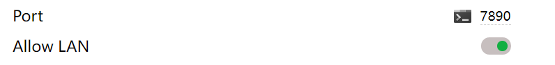

# Docker Container 代理配置一本通


由于一些原因，我们常常需要在开发中使用代理，但是在实践过程中我们发现在 Container 中我们无法直接使用主机配置好的代理。本文将给出不同平台下配置 Container 中的代理的方法。
<!--more-->

本文的目的是为工作提供方便，很多公司开发过程中都需要使用代理连接内部资源服务器，请勿将本文所述内容用于违法用途！

对此产生的任何影响本人概不负责！




## 综述

对于 Container 的配置分为两种情况：

1. 使用[Dockerfile]/[Docker-compose]分步构建过程中是需要使用代理
   - 例如需要使用公司内部镜像下载软件包
2. 构建好的容器需要使用代理

对于上述两种情况，经过查阅 Docker 相关文档，**所有平台下**对 Container 的代理配置都可以转化为**一个操作**：

> 在 Container 中设置 ``http_proxy`` / `` https_proxy`` 这两个环境变量
>
> 
 注意这里的**大小写**，如果只设置了  ``HTTP_proxy`` / `` HTTPS_proxy`` 可能在某些情况下无法正常工作，当然您也可以一块儿将这**四个**变量都设置了，不影响的。


## 配置方法

Docker 支持设定时给每个**新构建**的 Container 传递**永久**环境变量，有些人利用这一点直接传递 ``xxxx_proxy``，但是我**不希望你这样做**



如果你构建的镜像内部永久配置了 ``http_proxy`` 等 代理环境变量，那可能会导致你的镜像**在别人那里运行就会出现网络问题**，而对方可能对 Docker 或者 Linux 理解不深从而没有办法修复这个问题，这不符合一次构建到处运行的理念。



在正式开始之前，我们需要确定我们的代理已经允许了本地 LAN 并配置好了端口：




### 确定 http(s)_proxy  地址

在实际的使用中，我们需要传递的环境变量 ``http_proxy``  和 ``https_proxy`` （当然，你也可以继续传递 类似 ``ftp_proxy`` 等内容）

这时候对于不同平台我们需要使用不同的地址：

**Windows / MacOs**：

由于在这两个平台下 Docker 通过 NAT 的方式连接网络，我们无法获取一个固定的网关地址，所以 Docker-Desktop 为我们提供了一个访问网关的网址：``gateway.docker.internal``，所以我们直接使用这个地址即可。



```bash
https_proxy="https://gateway.docker.internal:7890"
http_proxy="http://gateway.docker.internal:7890"
```

 

**Linux**

Linux 下 docker 服务默认会创建一个 `docker0` 网桥，我们可以通过这个网桥让容器和主机进行通信，只需要在命令行输入：

```shell
$ ip addr show docker0
```

就可以看到 `docker0` 的信息：

```
4: docker0: <BROADCAST,MULTICAST,UP,LOWER_UP> mtu 1500 qdisc noqueue state UP group default 
    link/ether 02:42:84:54:33:33 brd ff:ff:ff:ff:ff:ff
    inet 172.17.0.1/16 brd 172.17.255.255 scope global docker0
       valid_lft forever preferred_lft forever
    inet6 fe80::42:84ff:fe54:3333/64 scope link 
       valid_lft forever preferred_lft forever
```

这里面 `inet 172.17.0.1/16 brd 172.17.255.255 scope global docker0` 就表示我们容器的网关为 `172.17.0.1`，我们使用网关即可直接访问我们主机：



```bash
https_proxy="https://172.17.0.1:7890"
http_proxy="http://172.17.0.1:7890"
```



### 从 Dockerfile 构建


以下示例均已 Linux 的为例，Windows/MacOs 用于请自行替换相应的地址！，怎么确定请往上面看！[确定 http(s)_proxy 地址]()


#### 1. 永久传递环境变量

使用 ``ENV`` 参数，这样传递进去的参数在此之后会一直留存在镜像之中：

```dockerfile
FROM ubuntu as base
# 放在开头，之后的指令就都会被这两条环境变量影响
ENV https_proxy="https://172.17.0.1:7890"
ENV http_proxy="http://172.17.0.1:7890"
# 其余命令
```

#### 2. 仅在构建时传递

使用 ``ARG`` 参数，这样两条代理指令仅在构建过程中起效，构建结束后的 Image 中不会留存相关环境变量：

```dockerfile
FROM ubuntu as base
# 放在开头，之后的指令就都会被这两条环境变量影响
ARG https_proxy="https://172.17.0.1:7890"
ARG http_proxy="http://172.17.0.1:7890"
# 其余命令
```

### 构建好的 Image


以下示例均已 Linux 的为例，Windows/MacOs 用于请自行替换相应的地址！，怎么确定请往上面看！[确定 http(s)_proxy 地址]()


对于已经构建好的 Image，我们对其配置代理有两种方式： 

#### 1. 传递永久环境变量

在启动的时候传入参数：



```shell
$ docker run --rm -it\
-e https_proxy="https://gateway.docker.internal:7890"\
-e http_proxy="http://gateway.docker.internal:7890"\
ubuntu # 这里换成你需要的image名
```

 

当然，您可也可以将这写环境变量写成一个 ``.env ``文件然后使用 ``--env-file`` 去统一导入：

例如 Linux 下``.env`` 文件：

```
http_proxy="http://172.17.0.1:7890"
https_proxy="https://172.17.0.1:7890"
```

之后这要进行导入：

```shell
$ docker run --rm -it --env-file .env ubuntu
```

#### 2. 临时传递

临时传递的方式较为简单，只需要先运行镜像：

```shell
$ docker run --rm -it ubuntu
```

在进入镜像后手动设置环境变量：

```shell
$ export http_proxy="http://172.17.0.1:7890"
$ export https_proxy="https://172.17.0.1:7890"
```

或者配合 VSCode 的 Remote-Container 插件配置后可以实现每次**自动设置**，具体方式请移步 [Docker 配合 VSC 开发最佳实践]()

### 已生成的 Container


以下示例均已 Linux 的为例，Windows/MacOs 用于请自行替换相应的地址！，怎么确定请往上面看！[确定 http(s)_proxy 地址]()


#### 1. 永久设定环境变量

修改 ``/etc/profile`` 或者 ``~/.bashrc`` 文件，在其中加入

```
export http_proxy="http://172.17.0.1:7890"
export https_proxy="https://172.17.0.1:7890"
```

#### 2. 临时设定

在进入镜像后手动设置环境变量：

```shell
$ export http_proxy="http://172.17.0.1:7890"
$ export https_proxy="https://172.17.0.1:7890"
```

或者配合 VSCode 的 Remote-Container 插件配置后可以实现每次**自动设置**，具体方式请移步 [Docker 配合 VSC 开发最佳实践]()


## 结语

以上就是配置 Docker 容器代理的全部方法，经过实践真实可用
