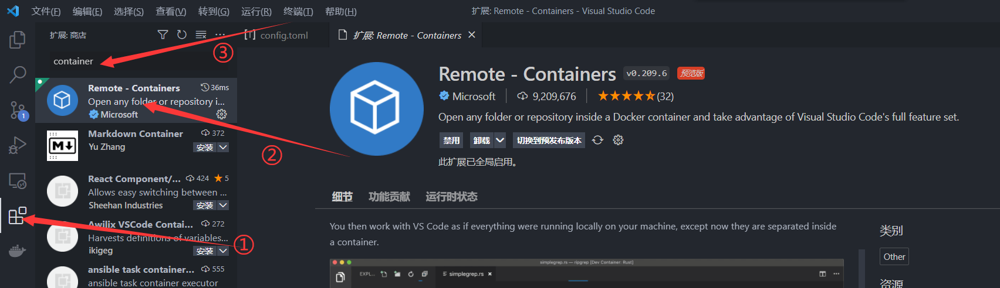
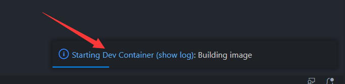

# Docker配合VSC开发最佳实践


## 前言

### 为什么我们需要虚拟环境？

很长时间以来最让我头疼的事情就是配置开发环境，最简单的一个例子是配置深度学习使用的 Python 环境。如果在本机上直接配置 Python 环境很容易出现各种问题，例如 Pytorch 和 Tensorflow 可能会同时依赖某个库的不同版本，这就会导致**可能只有特定版本 Pytorch 和 Tensorflow 才有机会共存**，而你在安装的时候很可能都没有意识到这个问题。

直到你运行某段代码时 **Python 解释器给你报了几百行的错误**你才意识哪里出了点问题，但是你又不知道是什么，于是你就会**花上几天的时间**改代码、查资料，最后你明白是你的环境配置有问题，于是又手动清理之前安装错误的 Python 库，并尝试重新运行之前的代码。



当然，更多的时候这会开启新一个痛苦的轮回





所幸，现在我们可以使用 Anaconda 进行 Python 环境管理，不同的环境相互隔离以免出现冲突。conda 对于依赖的检查也比 pip 更好用，基本上不会出现依赖冲突问题



这一套的流程下来我相信无论是谁也受不了，**但是环境问题远不止如此**



- 某段代码只能在某几个特定的电脑上才能运行
- 某段代码你睡了一觉后就无法运行了
- 你辛苦配了好久的环境不好使了/需要换电脑了/需要给别人也整一份
- 你有两项工作要做，但是这两项工作需要安装的包是冲突的，而且重新安装极其麻烦
- 你安装了某个包，然后你的操作系统就出了问题，即使卸载这个包也没有用
- 你想在 Linux 上使用 N卡 于是你按照网上的教程配置了显卡，然后你的显卡就不好使了
- 某个古董程序只能在老版 Linux 上运行
- ……



应对以上问题，我们当然可以简单的给电脑做多系统/每次重装系统/买新的电脑来解决，但更为经济的做法是**使用容器技术**。

### Docker VS 虚拟机

- 快 

  - Docker 的启停都是以秒或者毫秒为单位的，诸如 VM 等软件的启停最少也需要几分钟的时间

  - 只要使用一行指令 / 一个 [Dockerfile]/[docker-compose] 文件 即可快速[启动]/[部署]我们的环境
- 轻量

  - Docker 环境不需要虚拟完整的操作系统或者硬件**镜像体积天生就小**，且基于联合文件系统可以让不同镜像间使用到的相同文件进行共用，**进一步压缩了镜像体积**。（一些常用的开发环境甚至只有不到 100M）

  - 虚拟机需要大量的资源去虚拟完整的操作系统甚至是硬件无法实现多开；Docker 只占用很少的运行时资源，一**台机器可以开启少则几十多则几百上千个** Docker Container
- 快速回滚
  - 容器技术天生带有回滚属性，因为每个历史容器或者镜像都会有保存，而替换一个容器或者某个历史镜像是非常快速和简单的，**你可以快速回到某一次的更改**
- 隔离性强

  - 一台机器上可以启动多个 Docker 容器，而且**容器之间环境隔离不会互相干扰**
- 易分享

  - 你只需要将你的 Container 镜像推送到云端或者直接分享给你的 [Dockerfile]/[docker-compose] 文件给其他人即可**让其他人在几分钟内快速部署和你相同的环境**
  - 你能够保证其他人都能使用和你**一模一样**的镜像
  - Docker 是跨平台的产品，同样的镜像可以在 Windows / MacOs / Linux 上同时使用，而且效果相同
- 低成本

  - 一台机器上可以启动几十上百个 Docker 容器
  - 使用 Docker Swarm / K8s 等编排工具可以快速编排管理成百上千的容器

### VSCode 与 Docker 结合

VSCode 是什么相信我不必多言，依托于其 Remote Container 插件，我们可以快速地（真的很快:rocket:）连接到 Docker 容器中去，实现在**本地编写程序，一键容器中调试运行**——而这一切跟你直接在宿主机上开发几乎一模一样。而用虚拟机的话光是不同屏幕之间切换以及文件同步之类的操作就够惹人烦了。

再者，配合 VSCode 原生的 launch 和 task 配置并绑定相应段快捷键，我们可以节省很多应用编译时需要进行的操作（比如输入编译指令、清理目录等）

## Docker 学习

Docker 网络上的教程有很多，我相信我很难讲出比现有课程更好的效果，在这里我只推荐我认为讲的最好的一个课程，**内容精简实践性强**，大概花上两个下午就能学完。

[【狂神说Java】Docker最新超详细版教程通俗易懂](https://www.bilibili.com/video/BV1og4y1q7M4)



以及进阶版：

[【狂神说Java】Docker进阶篇超详细版教程通俗易懂](https://www.bilibili.com/video/BV1kv411q7Qc)



学完了这两门课程我相信你基本上能够熟练地是使用 Docker 了，下一节我们来说如何让 VSCode 连接 Docker 环境

## VSCode 连接 Container


在进行本节内容之前请先确保你已经学会了 Docker 相关知识


### Remote Containers 插件安装




1. 打开插件市场（图中 ① 箭头所示）
2. 在搜索框输入 container 搜索插件（图中 ③ 所示）
3. 找到 Remote-Containers 插件在打开的页面中安装插件（途中 ② 所示）

等待插件安装成功之后应该能发现在 VSCode 左下角出现一个新的小图标，左边也出现了一个 Docker 图标


### Remote Containers 插件使用

> 严格上来讲本节内容是对 Remote-Containers 插件 [官方文档](https://code.visualstudio.com/docs/remote/containers)  的翻译与浓缩。

#### 初体验

在 https://github.com/microsoft/vscode-remote-try-python 下载解压官方示例仓库并使用 VSCode 打开文件夹，您应该得到如下组织的目录：

```
.
│  .gitattributes
│  .gitignore
│  app.py
│  LICENSE
│  README.md
│  requirements.txt
│
├─.devcontainer
│      devcontainer.json
│      Dockerfile
│
├─.vscode
│      launch.json
│
└─static
        index.html
```

在根目录用 VS Code 打开文件夹，然后点击左下角的图标


在弹出的窗口中选择 Reopen in Container


VS Code 会根据 `.devcontainer` 文件夹中的 `Dockerfile` 和 `devcontainer.json` 自动拉取并配置镜像环境，点击蓝色字样（show log）可以查看当前环境构建进度



首先 VS Code 会根据 `Dockerfile` 文件描述进行 build image 并 docker run 生成 container


紧接着，VS Code 会根据 `devcontainer.json` 文件中的描述进行一些配置工作，比如这里会在 container **首次运行**的时候执行

```shell
$ pip3 install -r requirements.txt
```

来安装运行 python 程序需要的支持库


以及会根据  `devcontainer.json` 中的配置为我们的 container 自动安装一些插件，比如这里会提示 Pylance 需要重新加载窗口来激活：


这里我们选择 `是` 等待窗口加载完毕后点击窗口左侧的 运行和调试功能


点击 开始调试 ，VS Code 会自动帮我们运行这个 python 程序


> 关于 VS Code 的调试功能和 Task 功能是另外的话题，我会单独讲解，这里不会深入。

这时候我们发现 VS Code 帮我们自动转发了 python 程序提供的端口（真的非常方便:sparkles:）


点击在 浏览器中打开 即可看到这段程序提供的网页内容：


而这一切只会花费不到五分钟（根据网速而定），而且不会对宿主机产生任何影响！

#### devcontainer.json 探究

Dockerfile 在 [Docker 学习]() 章节已经讲过了，这里我就不介绍了。我们主要来探究 `devcontain.json` 到底讲了什么故事。

详细**文档**和**例子**请见 https://aka.ms/vscode-remote/devcontainer.json ，这里我们主要来看一下常用的一些配置信息：

- name

  当前工作空间名称，会显示在左下角

- build

  - dockerfile：  用于指定 dockerfile 文件的路径，这里是相对于 devcontainer.json 文件而言
  - context：用于指定 docker build 时的上下文路径，这里是相对于 devcontainer.json 文件而言
  - args：用于在 docker build 时传递参数

- settings

  用于设定容器中 settings.json 的默认值，比如这里设定了使用的 shell 路径和 python 插件的配置

- extensions

  用于指定在容器中安装的插件，比如这里会自动帮我们安装 pylance 插件

- portsAttributes

  用于设定端口属性，比如名称，映射时的行为，也可以用 `forwardPorts` 简单代替

- postCreateCommand

  在容器**第一次启动**时执行的指令，这里会自动安装依赖，**只会执行这一次**

- remoteUser

  登录到容器的用户名，默认情况下是 root 用户登录，但是有时我们不想这样，可以利用这个指定远程用户名（这个用户必须存在才行）


此外，还有一些字段也很有用：

- runArgs

  docker run 时传递的参数，用于类似设定 --network=host 等操作

- containerEnv / remoteEnv

  用于设定容器中的环境变量，比如设定 http_proxy 等环境变量的值

## 显示 Docker 中的图形界面

很多时候我们都需要查看 docker 中的图形界面，这里我们直接使用 X11 让 docker 中的 GUI 直接在宿主机上运行（相比于 VNC 方案更加轻量化）

现成的方案有这几个：

[在docker中通过X11运行gui程序](https://cloud.tencent.com/developer/article/1541718)

[Docker X11 穿透方案](http://open.daocloud.io/viz-parallel-magic/)

上面两个文章讲了原理和操作方法，下面给出如何在 VS Code 中配置

首先我们在 **devcontainer.json** 中的 `runArgs` 字段中添加 `"--volume=/tmp/.X11-unix:/tmp/.X11-unix"` 表示挂载 x11 相关目录到容器中

`containerEnv` 字段中添加 `"DISPLAY": "${localEnv:DISPLAY}" `  表示设定容器中的 `DISPLAY` 环境变量与本地 `DISPLAY` 为一样的值，例如：

```json
{
	"dockerFile": "Dockerfile",
	"build": {
		"args": {
			"WORKSPACE": "${containerWorkspaceFolder}"
		}
	},
	"remoteUser": "ros",
	"runArgs": [
		"--network=host",
		"--cap-add=SYS_PTRACE",
		"--security-opt=seccomp:unconfined",
		"--security-opt=apparmor:unconfined",
		"--volume=/tmp/.X11-unix:/tmp/.X11-unix",
		// "--gpus" "all", // 取消注释使用 GPU 功能
	],
	"containerEnv": { "DISPLAY": "${localEnv:DISPLAY}" },
	// Set *default* container specific settings.json values on container create.
	"settings": {
		"terminal.integrated.profiles.linux": {
			"bash": {
				"path": "bash"
			},
		},
		"terminal.integrated.defaultProfile.linux": "bash"
	}
```

最后，在我们的主机中打开一个命令行，输入：

```shell
$ xhost +
```

来允许我们的容器在宿主机上显示窗口。

至此即可完成将容器中 GUI 显示在宿主机的操作！

## 结语

至此 Docker 配合 VSCode 开发的内容就讲解完毕了，如果大家觉得有哪里需要改进或者拓展的地方还请在评论区提出，我会及时回复.

