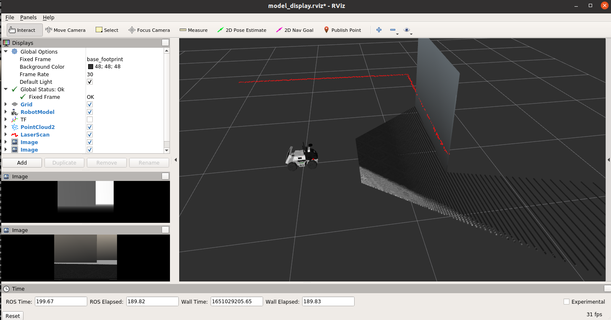

# limo 仿真指南


> 本文适合有 ROS1 基础和对 Gazebo 有了解的朋友

松灵机器人LIMO是全球首款集四种运动模态于一体的ROS开发平台，提供了适应场景更广泛、更符合行业应用要求的学习平台，适用于机器人教育、功能研发、产品开发。通过创新性的机械设计，能实现四轮差速、阿克曼、履带型、麦克纳姆轮运动模式的快速切换，可在配套的专业沙盘中快速建立多场景实拟教学和测试，LIMO搭载NVIDIA Jeston Nano、EAI XL2激光雷达、深度相机等高性能传感器配置，可实现精确的自主定位、SLAM建图、路线规划和自主避障、自主倒车入库、红绿灯识别等丰富功能。

<!--more-->

此外，松灵为用户提供了 limo 的完整 gazebo 仿真支持库，本文将带您逐步上手使用：

> 教程素材地址：

## 1. 环境配置

在笔者提供的教程素材中已经配置好了相关的 Docker+VSCode 配置，在这里我们使用``ROS-melodic`` + `Gazebo9` 作为仿真环境。

- 这里推荐使用 docker 作为开发环境，具体请移步 [我的 ROS 开发环境]() 和 [Docker 配合 VSC 开发最佳实践]()

- 如果启用 `GPU` 可以查看 [在 Docker 中使用 Nvidia 显卡]() 

下载教程素材：

> 推荐使用 ``git clone https://ghproxy.com/https://github.com/agilexrobotics/limo_courses/`` 下载

进入 ``gazebo_simulation`` 目录。确保 `ROS-melodic` 已经配置成功后运行 `setup_package.sh` 脚本会自动安装相关环境。之后即可正常编译与运行：

```shell
$ catkin_make
$ source devel/setup.bash
```

如果遇到了类似如下错误：


请更换 Ubuntu 的源再进行尝试。

## 2. 开始仿真

### 查看车辆模型

`limo_description` 包主要为 `limo` 仿真模型，`display_models.launch` 为车辆在` Rviz` 中的展示：

```shell
$ roslaunch limo_description display_models.launch# 在 Rviz 中查看
```

可以得到如下界面：


此时我们没有运行任何仿真环境，所以不存在传感器信息。

### gazebo 仿真 

`limo_gazebo_sim` 包为 `limo` 车型在 `gazebo` 中的仿真，`limo_xxx_.launch` 为车型在不同模式下于 `gazebo` 中仿真展示

```shell
# 两种模式任选其一
$ roslaunch limo_gazebo_sim limo_ackerman.launch # 在 gazebo 中使用 阿卡曼 模式运动
# roslaunch limo_gazebo_sim limo_four_diff.launch # 以四轮差速 模式运动
```

可以看到 Gazebo 中出现了我们的小车：


使用地图前需要补全 gazebo 的 models，不然会一直黑屏



并且 `Rviz` 中出现了 传感器 信息



这时，我们新开启一个终端运行：

```shell
$ rosrun teleop_twist_keyboard teleop_twist_keyboard.py 
```

则可以使用键盘控制 limo 进行移动

当然，您可能需要更换仿真所用的地图，这时候只需要修改 `limo_gazebo_sim/launch` 中所需运动模式文件中 `world_name` 标签参数即可：


## 建图与保存

``limo_bringup`` 为建图与导航功能包，首先启动我们的 `gazebo`（如果上一步的窗口没关，就不用新启动了）：

```shell
# 两种模式任选其一
$ roslaunch limo_gazebo_sim limo_ackerman.launch # 使用 阿卡曼 模式运动
# roslaunch limo_gazebo_sim limo_four_diff.launch # 以四轮差速 模式运动
```

然后启动 ``gmapping`` 建图服务：

```shell
$ roslaunch limo_bringup limo_gmapping.launch
```

之后即可在 ``rviz`` 中看到雷达地图：



如果没有雷达地图出现，请在 Rviz 中手动订阅 `/map` 话题，并检查其余 `display` 项目中订阅话题是否正确。


打开 ``teleop_twist_keyboard``，控制我们的小车在场地中溜达一圈以构建地图：

```shell
$ rosrun teleop_twist_keyboard teleop_twist_keyboard.py 
```

然后保存我们的地图：

```shell
$ cd src/limo_bringup/maps
$ rosrun map_server map_saver -f map1
```

即可保存我们的地图在 `maps` 中

### 自动导航

如果在这里您的地图存放到了别处或者名字不同，则需要修改启动文件 

关闭上一步中我们的 `gmapping` 节点，启动 `navigation` :

```shell
# 根据之前选择的运动模式进行选择：
$ roslaunch limo_bringup limo_navigation_ackerman.launch # 阿卡曼模式
# roslaunch limo_bringup limo_navigation_diff.launch # 四轮差速模式
```


这里最好重新启动一下 `limo_gazebo_sim` ，或者手动将小车开回原点，不然导航地图可能没法自动校准



4

等待服务启动以后我们回到 `Rviz` 中即可看到我们之前扫描的地图：


点击 `Rviz` 窗口上的  `2D Nav Goal` 并在地图选择一个点，即可看到小车会自动导航：


## 3. 其他包的使用

除了官方提供的 `gmapping` 和 `navigation` 您也许想要尝试配置其他的包，这里只需要注意话题映射，limo 的 `scan` 和 `imu`

分别发布在了 `/limo/scan` 和 `/limo/imu` ，如果您的包需要订阅这两个话题则需要手动重新映射：


## 4. 结语

至此，关于 ``limo`` 的仿真教程就结束了，如果您有任何疑问或者问题，欢迎在官方课程仓库提出 `issu`。

