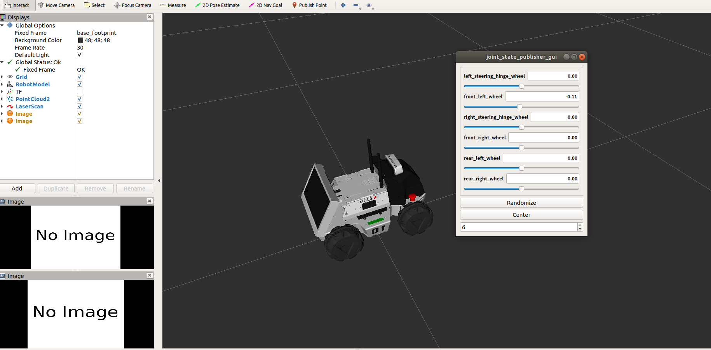
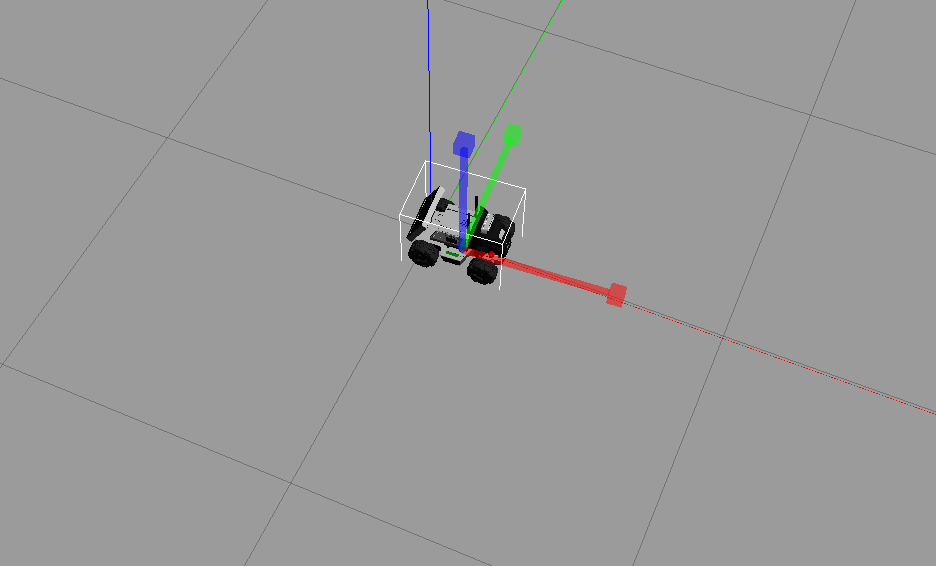
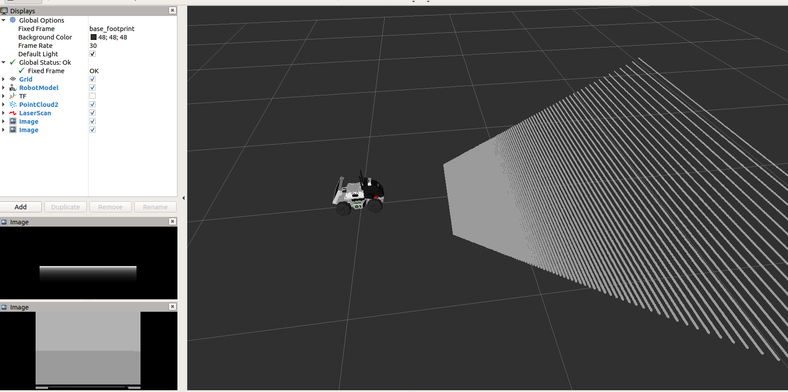

# limo 仿真指南


> 本文适合有 ROS1 基础和对 Gazebo 有了解的朋友

松灵机器人LIMO是全球首款集四种运动模态于一体的ROS开发平台，提供了适应场景更广泛、更符合行业应用要求的学习平台，适用于机器人教育、功能研发、产品开发。通过创新性的机械设计，能实现四轮差速、阿克曼、履带型、麦克纳姆轮运动模式的快速切换，可在配套的专业沙盘中快速建立多场景实拟教学和测试，LIMO搭载NVIDIA Jeston Nano、EAI XL2激光雷达、深度相机等高性能传感器配置，可实现精确的自主定位、SLAM建图、路线规划和自主避障、自主倒车入库、红绿灯识别等丰富功能。

<!--more-->

此外，松灵为用户提供了 limo 的完整 gazebo 仿真支持库，本文将带您逐步上手使用：

> 仓库地址：

## 0. 工作目录

我们从 官方仓库 下载仿真包，进入`` limo`` 目录复制其中的文件，按照如下方式组织我们的工作空间（这里的 ``.devcontianer`` 是因为我使用了 `Docker` 的原因，如果您未用到可以忽略，具体请看 下一节 内容）

```
.
├── limo
│   ├── .devcontainer
│        ├── devcontainer.json
│        └── Dockerfile
│   └── src
│       ├── limo_description
│       └── limo_gazebo_sim
```

## 1. 环境配置

``limo`` 使用 ``ROS-melodic`` + `Gazebo9` 作为仿真环境，如果您已经拥有此环境请跳过此节

这里推荐使用 docker 作为开发环境，具体请移步 [我的 ROS 开发环境]() 和 [Docker 配合 VSC 开发最佳实践]()

如果启用 `GPU` 可以查看 [在 Docker 中使用 Nvidia 显卡]() 

此处我们使用的 Dockerfile 文件如下：

```dockerfile
FROM althack/ros:melodic-gazebo as gazebo

# Set up auto-source of workspace for ros user
ARG WORKSPACE
RUN echo "if [ -f ${WORKSPACE}/install/setup.bash ]; then source ${WORKSPACE}/install/setup.bash; fi" >> /home/ros/.bashrc

# 如果启用 GPU 支持则取消下面的注释
# RUN apt-get update \
#     && apt-get install -y -qq --no-install-recommends \
#     libglvnd0 \
#     libgl1 \
#     libglx0 \
#     libegl1 \
#     libxext6 \
#     libx11-6 \
#     && apt-get autoremove -y \
#     && apt-get clean -y \
#     && rm -rf /var/lib/apt/lists/*
# ENV DEBIAN_FRONTEND=dialog

# # Env vars for the nvidia-container-runtime.
# ENV NVIDIA_VISIBLE_DEVICES all
# ENV NVIDIA_DRIVER_CAPABILITIES graphics,utility,compute

# ENV QT_X11_NO_MITSHM=1
```

devcontainer.json 内容如下：

```json
// See https://aka.ms/vscode-remote/devcontainer.json for format details.
{
	"dockerFile": "Dockerfile",
	"build": {
		"args": {
			"WORKSPACE": "${containerWorkspaceFolder}"
		}
	},
	"remoteUser": "ros",
	"runArgs": [
		"--network=host",
		"--cap-add=SYS_PTRACE",
		"--security-opt=seccomp:unconfined",
		"--security-opt=apparmor:unconfined",
		"--volume=/tmp/.X11-unix:/tmp/.X11-unix",
		//"--gpus" "all", //取消注释开启 GPU 功能
	],
	"containerEnv": { "DISPLAY": "${localEnv:DISPLAY}" },
	// Set *default* container specific settings.json values on container create.
	"settings": {
		"terminal.integrated.profiles.linux": {
			"bash": {
				"path": "bash"
			},
		},
		"terminal.integrated.defaultProfile.linux": "bash"
	},
	"extensions": [
		"dotjoshjohnson.xml",
		"zachflower.uncrustify",
		"ms-azuretools.vscode-docker",
		"ms-iot.vscode-ros",
		"ms-python.python",
		"ms-vscode.cpptools",
		"redhat.vscode-yaml",
		"smilerobotics.urdf",
		"streetsidesoftware.code-spell-checker",
		"twxs.cmake",
		"yzhang.markdown-all-in-one"
	]
}

```

## 2. 初始化仿真环境

首先更新 `apt` 和 `rosdep database` 保持最新

```shell
$ sudo apt update
$ rosdep update
```

然后安装仿真依赖库：

```shell
$ sudo apt-get -y install --no-install-recommends \
ros-melodic-ros-control \
ros-melodic-ros-controllers \
ros-melodic-gazebo-ros \
ros-melodic-gazebo-ros-control \
ros-melodic-joint-state-publisher-gui \
ros-melodic-teleop-twist-keyboard
```

下一步初始化工作空间并安装依赖：

```shell
$ cd limo/src
$ catkin_init_workspace
$ cd ..
$ rosdep install --from-paths src --ignore-src -r -y
```

即可正常编译与运行：

```shell
$ catkin_make
$ source devel/setup.bash
```

`limo_description` 包主要为 `limo` 仿真模型，`display_models.launch` 为车辆在` Rviz` 中的展示：

```shell
$ roslaunch limo_description display_models.launch# 在 Rviz 中查看
```

可以得到如下界面：



 `limo_gazebo_sim` 包为 `limo` 车型在 `gazebo` 中的仿真，`limo_xxx_.launch` 为车型在不同模式下于 `gazebo` 中仿真展示

```shell
$ roslaunch limo_gazebo_sim limo_ackerman.launch # 在 gazebo 中使用 阿卡曼 模式运动
```

可以看到 Gazebo 中出现了我们的小车



并且 `Rviz` 中出现了 传感器 信息



这时，我们新开启一个终端运行：

```shell
$ rosrun teleop_twist_keyboard teleop_twist_keyboard.py 
```

则可以使用键盘控制 limo 进行移动


使用其他地图前需要补全 gazebo 的 models，不然会一直黑屏


