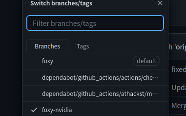

# 我的 ROS 开发环境


本文主要介绍我所使用的 ROS 开发环境
我采用这个模式进行开发是受到了这篇文章的启发：
<!--more-->

如果您用过 ROS 就会发现配置这玩意儿的开发环境是一件非常麻烦的事情，经常会出现缺少支持库或者支持库冲突的情况，尤其是一台电脑上需要做多种任务的情况（比如 深度学习、QT开发、ROS1、ROS2）则会更糟糕。
这个时候我们就有必要使用 Docker 进行开发，关于如何使用 `VSCode + Docker` 进行开发的流程已经写在：[Docker 配合 VSC 开发最佳实践]()，本文主要介绍如何配置 ROS 相关开发环境

>  如果您不会使用 docker 或者没有尝试过类似的操作，请您先阅读 [Docker 配合 VSC 开发最佳实践]()

如果您使用 ``ROS-foxy`` 可以直接使用  作为您的工作目录，如果您需要使用 GPU 加速计算，则选择 带有 ``foxy-nvidia`` 的分支即可



**下面我将带您从头配置相关文件**

## 0. 新建目录

VSCode 会自动读取 `.devcontainer` 中的配置文件，目录结构如下：

```
.
├── .devcontainer
│   ├── devcontainer.json
│   └── Dockerfile
```

## 1. 选取开发镜像

这里我一直使用的是  的镜像。

> dockerfile 源码：

例如我最近需要使用 `ROS-melodic` + `Gazebo` 则会选择  中带有 `melodic-gazebo` 标签的镜像。

## 2. 配置 dockerfile

我们使用如下脚本

```dockerfile
# 改编自 https://github.com/athackst/vscode_ros2_workspace
FROM althack/ros:melodic-gazebo as gazebo # 我使用的镜像

# ** [可选] 取消注释安装其他组件 **
#
# ENV DEBIAN_FRONTEND=noninteractive
# RUN apt-get update \
#    && apt-get -y install --no-install-recommends <your-package-list-here> \
#    #
#    # Clean up
#    && apt-get autoremove -y \
#    && apt-get clean -y \
#    && rm -rf /var/lib/apt/lists/*
# ENV DEBIAN_FRONTEND=dialog

# 为 ros 用户配置自动 source
ARG WORKSPACE
RUN echo "if [ -f ${WORKSPACE}/install/setup.bash ]; then source ${WORKSPACE}/install/setup.bash; fi" >> /home/ros/.bashrc
```

如果需要 GPU 支持（需要安装 nvidia-docker) 则在上述脚本之后追加如下指令：

```dockerfile
RUN apt-get update \
    && apt-get install -y -qq --no-install-recommends \
    libglvnd0 \
    libgl1 \
    libglx0 \
    libegl1 \
    libxext6 \
    libx11-6 \
    && apt-get autoremove -y \
    && apt-get clean -y \
    && rm -rf /var/lib/apt/lists/*
ENV DEBIAN_FRONTEND=dialog

# Nvidia 运行时变量.
ENV NVIDIA_VISIBLE_DEVICES all
ENV NVIDIA_DRIVER_CAPABILITIES graphics,utility,compute

ENV QT_X11_NO_MITSHM=1
```

## 3. 配置 devcontainer.json

```json
// 改编自 https://github.com/athackst/vscode_ros2_workspace
// See https://aka.ms/vscode-remote/devcontainer.json for format details.
{
	"dockerFile": "Dockerfile",
	"build": {
		"args": {
			"WORKSPACE": "${containerWorkspaceFolder}"
		}
	},
	"remoteUser": "ros",
	"runArgs": [
		"--network=host",
		"--cap-add=SYS_PTRACE",
		"--security-opt=seccomp:unconfined",
		"--security-opt=apparmor:unconfined",
		"--volume=/tmp/.X11-unix:/tmp/.X11-unix",
		// "--gpus" "all", // 取消该注释使用 GPU 功能
	],
	"containerEnv": { "DISPLAY": "${localEnv:DISPLAY}" },
	// Set *default* container specific settings.json values on container create.
	"settings": {
		"terminal.integrated.profiles.linux": {
			"bash": {
				"path": "bash"
			},
		},
		"terminal.integrated.defaultProfile.linux": "bash"
	},
    // 推荐安装的插件
	"extensions": [
		"dotjoshjohnson.xml",
		"zachflower.uncrustify",
		"ms-azuretools.vscode-docker",
		"ms-iot.vscode-ros",
		"ms-python.python",
		"ms-vscode.cpptools",
		"redhat.vscode-yaml",
		"smilerobotics.urdf",
		"streetsidesoftware.code-spell-checker",
		"twxs.cmake",
		"yzhang.markdown-all-in-one"
	]
}
```

## 4. 构建镜像

我们使用 VSCode 打开文件夹，并且 `Reopen in docker` 即可（不要自己只使用 Dockerfile 进行构建，因为在 devcontainer.json 中我们还挂载了一些目录，添加了一些参数）

## 5. 显示 容器 中的窗口

在宿主机中打开一个新的终端，输入：

```shell
$ xhost +
```

之后再运行类似 `Gazebo` 等图形程序，其界面就会直接在我们的宿主机中显示出来。


---

> 作者: Anthony  
> https://anthonysun256.github.io/my_ros_env/
