# 一步到位解决开发环境一致性问题


在 ROS 开发过程中（尤其是在多人团队中）你一定遇到过这样的问题：需要快速（在不同架构机器上）部署相同开发环境、别人电脑上可以编译但到了自己这里就会报错、无法复现别人的 Bug、经常会出现缺少支持库或者支持库冲突的情况，**尤其是一台电脑上需要做多种任务的情况**（比如 深度学习、QT 开发、ROS1、ROS2）则会更糟糕…… 这个时候我们就有必要使用 Docker 进行开发

<!--more-->

无论您之前使用什么样的方式进行开发，笔者在这里都推荐您尝试 Docker + VSCode，虽然这可能需要两三个下午的时间进行学习，但请相信这一切都是值得的！

> 如果您不会使用 docker 或者没有尝试过类似的操作，请您先阅读 《Docker 配合 VSC 开发最佳实践》(https://anthonysun256.github.io/docker-with-vsc_best-practice/)

## 1. 镜像选取

Docker 官方镜像服务器上有很多的 ROS 开发镜像，这里我们可以有如下选择（这几个镜像也是笔者常用的）：

- ROS 官方镜像：https://hub.docker.com/_/ros

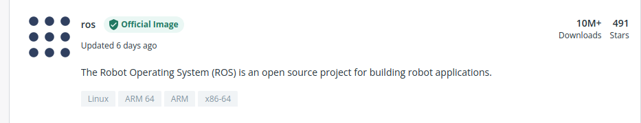

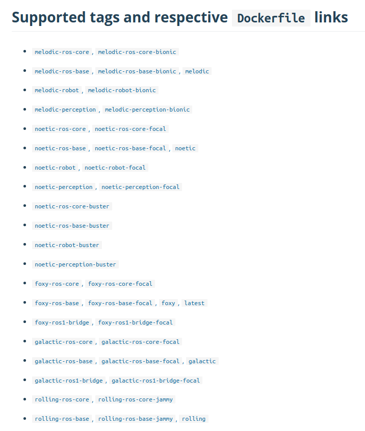

内含所有 ROS 发行版的基础开发镜像，而且支持多种架构，非常适合在多种架构的机器上进行部署。

- althack 的开发镜像 https://hub.docker.com/u/althack

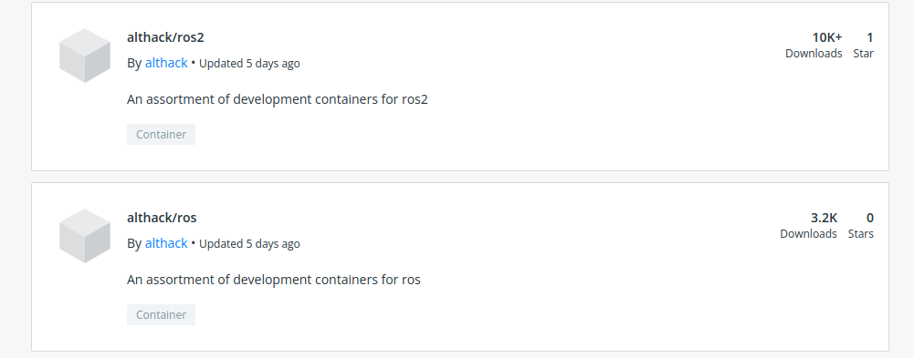

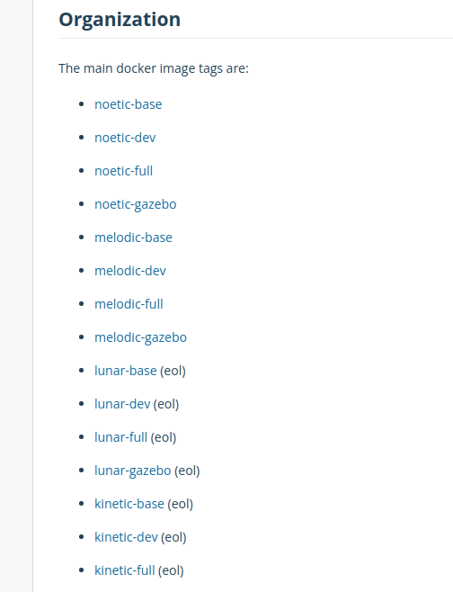98

> althack 提供了 VSCode 的开发工作环境模板：https://github.com/athackst/vscode_ros2_workspace
>
> 虽然模板是 ROS2 但是只要简单修改 Dockerfile 中引用的镜像名称即可改成 ROS1 环境
>
> Dockerfile 源码：https://github.com/athackst/dockerfiles

这个镜像优点是提供了 ROS-desktop-full 的开发环境，省去了自行安装的麻烦，非常适合学习使用。缺点是只支持 PC，如果其他环境需要自己使用 Dockerfile 编译。

## 2. 开发环境搭建

我们新建的工作空间目录格式如下：

```
.
├── .devcontainer # docker 配置文件
│   ├── devcontainer.json
│   └── Dockerfile
└── src # ROS 源码目录
```

VSCode 会自动读取 `.devcontainer` 中的配置文件。对于我个人学习而言我一直使用的是 https://hub.docker.com/u/althack 的镜像和配置，下面的配置文件也是改变于此，各位读者可以根据自己的需要进行修改：

**Dockerfile**：

```dockerfile
# 改编自 https://github.com/athackst/vscode_ros2_workspace
# 我使用的 ROS 学习镜像，根据您的喜好可以自行更改
FROM althack/ros:melodic-gazebo as gazebo 

# ** [可选] 取消注释安装其他组件 **
#
# ENV DEBIAN_FRONTEND=noninteractive
# RUN apt-get update \
#    && apt-get -y install --no-install-recommends <your-package-list-here> \
#    #
#    # Clean up
#    && apt-get autoremove -y \
#    && apt-get clean -y \
#    && rm -rf /var/lib/apt/lists/*
# ENV DEBIAN_FRONTEND=dialog

# 为 ros 用户配置自动 source
ARG WORKSPACE
RUN echo "if [ -f ${WORKSPACE}/install/setup.bash ]; then source ${WORKSPACE}/install/setup.bash; fi" >> /home/ros/.bashrc
```

如果需要 GPU 支持（需要安装 nvidia-docker [ https://anthonysun256.github.io/docker_with_nvidia/ ] 则在上述脚本之后追加如下指令：

```dockerfile
RUN apt-get update \
    && apt-get install -y -qq --no-install-recommends \
    libglvnd0 \
    libgl1 \
    libglx0 \
    libegl1 \
    libxext6 \
    libx11-6 \
    && apt-get autoremove -y \
    && apt-get clean -y \
    && rm -rf /var/lib/apt/lists/*
ENV DEBIAN_FRONTEND=dialog

# Nvidia 运行时变量.
ENV NVIDIA_VISIBLE_DEVICES all
ENV NVIDIA_DRIVER_CAPABILITIES graphics,utility,compute

ENV QT_X11_NO_MITSHM=1
```
**devcontainer.json**

```json
// 改编自 https://github.com/athackst/vscode_ros2_workspace
// See https://aka.ms/vscode-remote/devcontainer.json for format details.
{
    "dockerFile": "Dockerfile",
    "build": {
        "args": {
            "WORKSPACE": "${containerWorkspaceFolder}"
        }
    },
    "remoteUser": "ros",
    "runArgs": [
        "--network=host",
        "--cap-add=SYS_PTRACE",
        "--cap-add=SYS_RAWIO",
        "--privileged=true",
        "--security-opt=seccomp:unconfined",
        "--security-opt=apparmor:unconfined",
        "--volume=/tmp/.X11-unix:/tmp/.X11-unix",
        // "--gpus" "all", // 取消该注释使用 GPU 功能
        "--device=/dev/bus/usb:/dev/bus/usb", // 挂载外部硬件，比如摄像头，根据需要修改路径
    ],
    "containerEnv": {
        "DISPLAY": "${localEnv:DISPLAY}"
    },
    // Set *default* container specific settings.json values on container create.
    "settings": {
        "terminal.integrated.profiles.linux": {
            "bash": {
                "path": "bash"
            },
        },
        "terminal.integrated.defaultProfile.linux": "bash"
    },
    // 推荐安装的插件
    "extensions": [
        "dotjoshjohnson.xml",
        "zachflower.uncrustify",
        "ms-azuretools.vscode-docker",
        "ms-iot.vscode-ros",
        "ms-python.python",
        "ms-vscode.cpptools",
        "redhat.vscode-yaml",
        "smilerobotics.urdf",
        "streetsidesoftware.code-spell-checker",
        "twxs.cmake",
        "yzhang.markdown-all-in-one"
    ]
}
```

## 3. 启动开发环境

我们使用 VSCode 打开文件夹，并且 `Reopen in docker` 即可（不要自己只使用 Dockerfile 进行构建，因为在 devcontainer.json 中我们还挂载了一些目录，添加了一些参数）

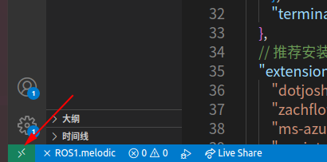

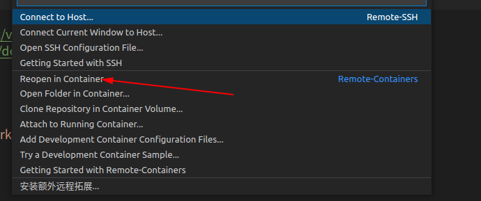

> 根据网络状况不同初次启动这里可能需要等待 VSCode 安装一些组件，请耐心等待，下次启动即可极速启动
>
> 部分挂载的设备可能需要 root 权限才能访问，这一点需要注意

## 4. 查看图形界面

在我们的主机中，打开一个终端，运行 `xhost +` 

之后在我们 VSCode 中的命令行中随便打开一个图形界面，比如 rqt，可以看到 rqt 直接显示在了我们的屏幕上

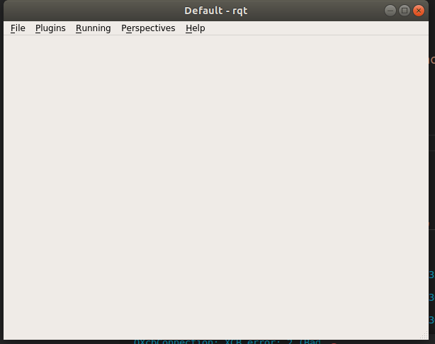

> 对于 Rviz 和 Gazebo，如果您的电脑上没有显卡、未正确安装闭源显卡驱动或者没有正确开启 nvidia-docker 显卡功能那界面会很卡，这和用不用 Docker 没有关系

## 5.插件简介

笔者的 `devcontainer.json` 中会为大家安装一些实用插件，这部分我们简略了解一下

- ROS——这个插件可以帮助我们快速更新 VSCode 中有关 ROS include 的路径，而且提供了图形界面查看 ROS 话题、服务等

  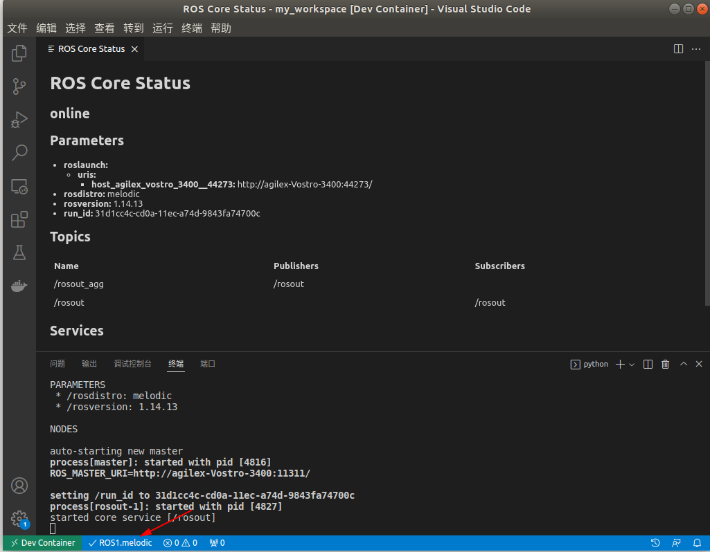

  按下 `shift+ctrl+p` 呼出快捷命令栏，输入 ros，可以看到自动更新选项

  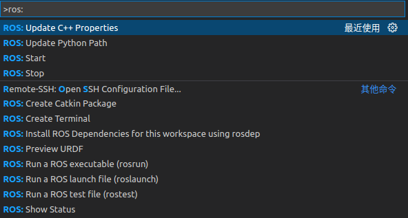

  - yaml xml xacro 语法助手

  这个可说的不多，能够帮助我们快速编写相应的文件，为其提供智能补全

  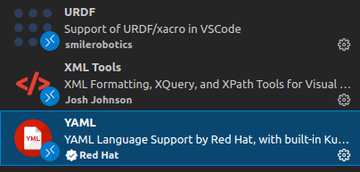

## 6.修复本地包 include / import 错误

默认情况下 ROS 插件可能不会包含我们本地路径的包，这并不会导致编译错误，但是会导致我们无法使用智能提示。

> msg 类型的包需先编译生成对应的 c++或者python头文件（在 devel 或者 install 中寻找对应目录）

这时候我们需要手动添加路径到 `c_cpp_properties.json`（注意每条路径后需要有个逗号：

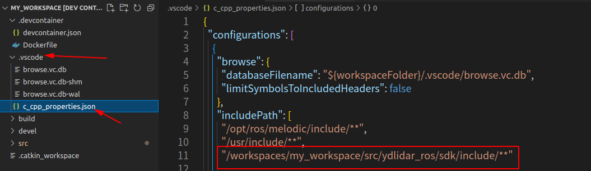

> 提示：我们**可以直接**在左侧资源管理器中右键文件夹在弹出的菜单中**复制文件夹的绝对路径**

python 同理：

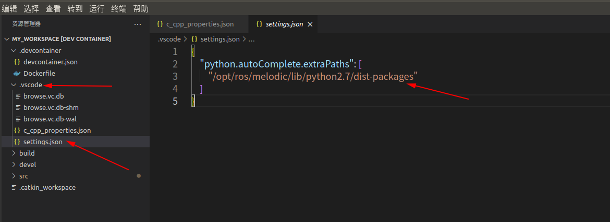

至此我们就能愉快的进行开发了，而且您还能保存自己的开发环境、推送到云端或者整理成压缩包进行分享，让团队中的所有人都能在几分钟之内拥有一致的开发环境，最重要的是还不会搞坏电脑本身的环境！

