# Scout_mini_navi


在之前的文章中我们介绍了如何在 Gazebo 中仿真 scout mini 以及如何添加自定义传感器，本章笔者将带领大家进行 scout mini 的建图与导航仿真。本文首先带领大家运行已配置好的仿真例程，然后为大家介绍所用的 Gazebo 插件和 ROS 库以及其配置过程。

## 1. 环境配置

在笔者提供的教程素材中已经配置好了相关的 Docker+VSCode 配置，在这里我们使用``ROS-melodic`` + `Gazebo9` 作为仿真环境。

- 这里推荐使用 docker 作为开发环境，具体请移步 [我的 ROS 开发环境]() 和 [Docker 配合 VSC 开发最佳实践]()

- 如果启用 `GPU` 可以查看 [在 Docker 中使用 Nvidia 显卡]() 

下载教程素材：

> 素材地址：https://gitee.com/agent-explorer/robotics/scout_mini_navigation

进入 ``scout_mini_navigation`` 目录。确保 `ROS-melodic` 已经配置成功后运行 `setup.sh` 脚本会自动安装相关环境。之后即可正常编译与运行：

```shell
$ catkin_make
$ source devel/setup.bash
```

如果遇到了类似如下错误：

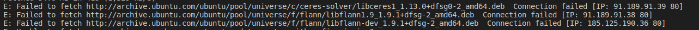

请更换 Ubuntu 的源再进行尝试

## 2.开始仿真

> 注意：教程使用的地图会用到 gazebo 模型，请事先下载（setup 脚本中会有提示是否自动安装）

首先使用 `gmapping` 进行建图

```shell
$ roslaunch scout_gazebo_sim scout_mini_gmapping.launch
```

会打开如下窗口，证明 gmapping 正常工作

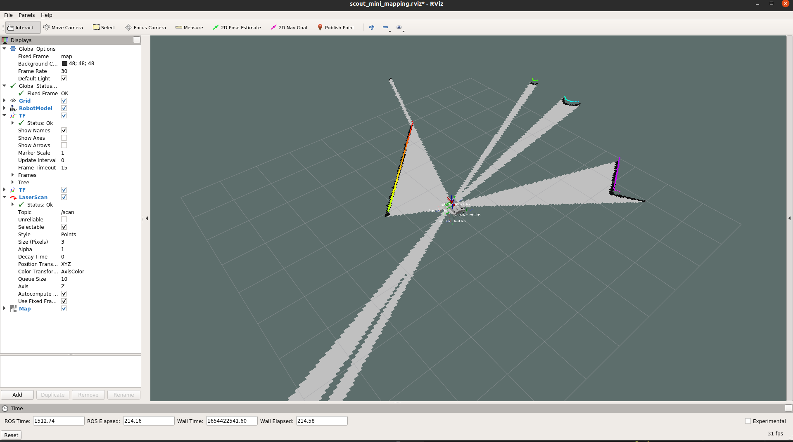

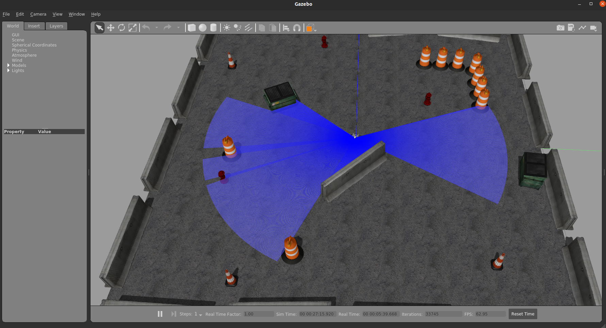

接下来打开一个新的终端，运行控制节点：

```shell
$ rosrun teleop_twist_keyboard teleop_twist_keyboard.py
```

控制车辆在地图中行走，直到将整幅地图构建完毕（可能会存在一些细小的窟窿，多走几遍可以消除）：

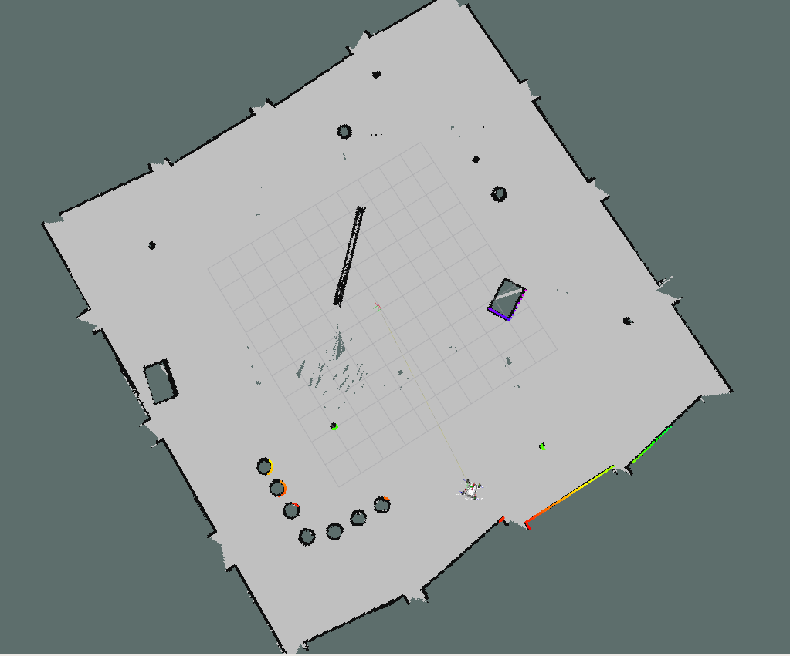

接下来保存地图：

```shell
$ cd src/scout_gazebo_sim/maps/
$ rosrun map_server map_saver -f mymap
```

即可在工作空间中看到我们新保存的地图：

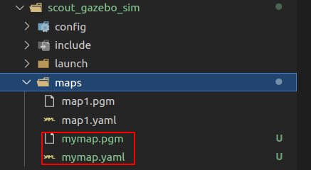

这里需确保 `mymap.yaml` 中 `image` 属性的值是相对路径：

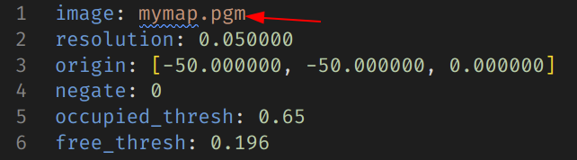

**此处如果使用绝对路径之后运行 `map_server` 时可能会出现问题**。

之后**关闭之前运行的所有节点**，修改导航启动文件使其加载我们刚刚保存的地图：

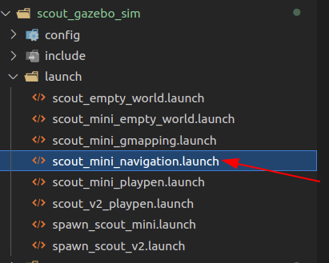

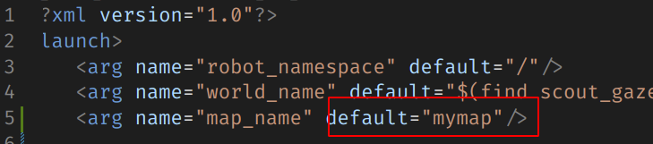

启动导航：

```shell
$ roslaunch scout_gazebo_sim scout_mini_navigation.launch
```

看到如下界面代表成功启动：

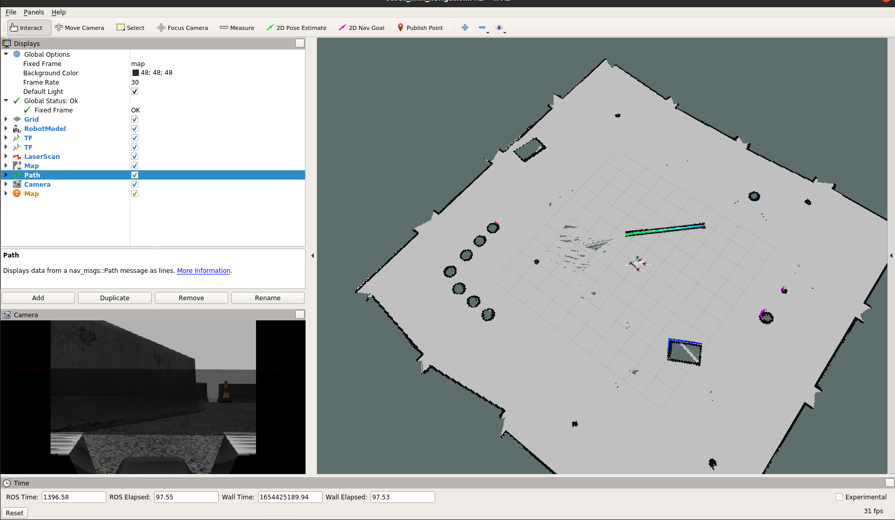


然后我们点击 rviz 的 `2D Nav Goal` 选项再点击地图上某点发布导航指令：

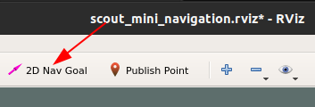

这里我点击的是红色箭头指向的点：

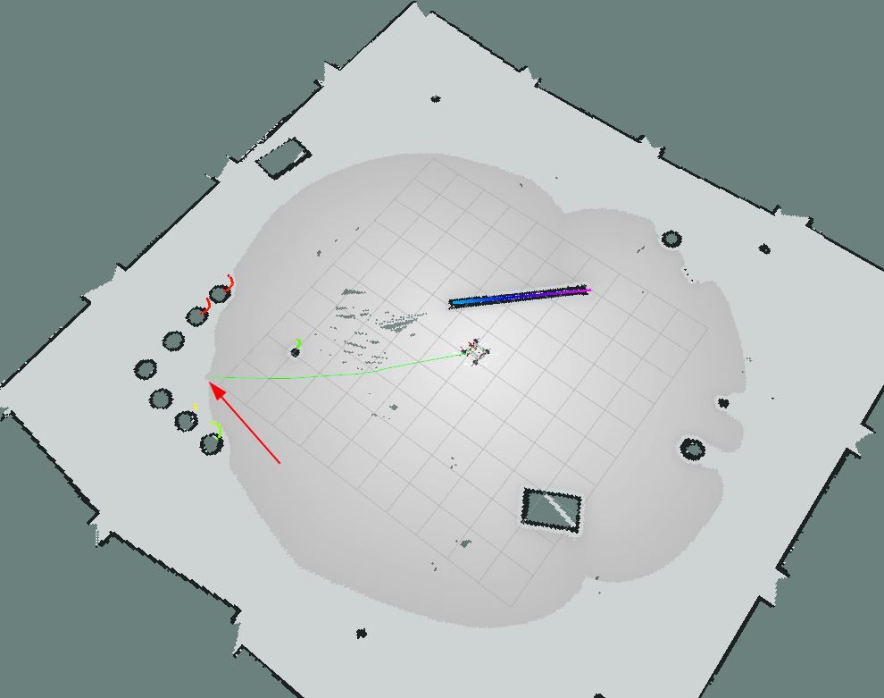

可以看到车辆开始自动导航行走，绿色路径代表全局规划路径：

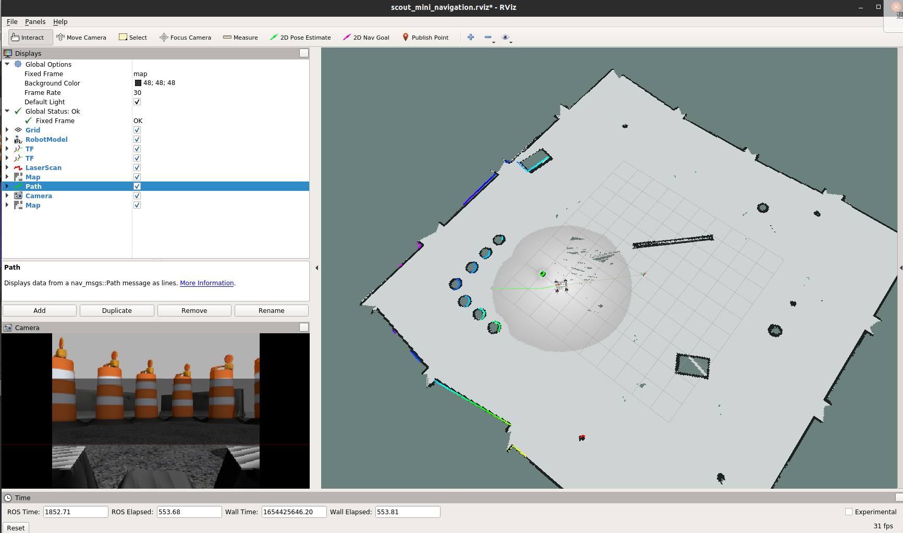

## 3.传感器配置

在之前的文章中我们以 RGB 相机为例介绍了如何给 scout mini 添加传感器，在本篇文章中笔者又增加了 `激光雷达` 与 `imu` 这两个传感器，其相关配置均在 `scout_description/urdf/empty.urdf` 中。

### 激光雷达

市面上有很多激光雷达，其参数各不相同。读者如果希望更改激光雷达参数可以照此部分进行修改。

Gazebo 提供了 `ray` 标签描述激光雷达，其包含 `scan` 和 `range` 两个属性，`scan` 描述激光雷达水平和垂直方向上的采样线数。`range` 定义每束激光的属性。

`scan` 标签内可以定义 `horizonta` 和 `vertical` 两个属性，其分别描述水平面和垂直面上激光：

```xaml
<ray>
    <scan>
        <horizontal>
            <!--- 水平方向上生成 720 条采样线 --->
            <samples>720</samples>
            <!--- 返回的范围数据点的个数 = 分辨率 * 样本数 --->
            <resolution>1</resolution>
            <!--- 最大和最小角度，弧度制。决定激光雷达扇形的范围 --->
            <min_angle>-2.09439504</min_angle>
            <max_angle>2.09439504</max_angle>
        </horizontal>
    </scan>
    <range>
        <!--- 每个采样线的 最小距离 和 最大距离 以及 分辨率  --->
        <min>0.05</min>
        <max>8.0</max>
        <resolution>0.01</resolution>
    </range>
    <noise>
       <!--- 添加高斯噪声 --->
        <type>gaussian</type>
        <mean>0.0</mean>
        <stddev>0.01</stddev>
    </noise>
</ray>
```

> `ray` 标签支持的所有属性可以在 http://sdformat.org/spec?ver=1.6&elem=sensor#sensor_ray 找到

之后我们还需要添加 Gazebo 雷达插件广播我们雷达的信息：

```xaml
<plugin name="sensor_ray_controller" filename="libgazebo_ros_laser.so">
    <topicName>/scan</topicName>  <!--- 雷达信息广播话题名 --->
    <frameName>sensor_ray</frameName>  <!--- 和雷达 link 名称一致 --->
</plugin>
```

> 可用插件可以在 https://classic.gazebosim.org/tutorials?tut=ros_gzplugins#Tutorial:UsingGazebopluginswithROS 找到

### IMU

和 激光雷达类似，其标签属性可以在 http://sdformat.org/spec?ver=1.6&elem=sensor#sensor_imu 找到，这里我们保持默认值，

插件信息可以在 https://classic.gazebosim.org/tutorials?tut=ros_gzplugins#IMUsensor(GazeboRosImuSensor) 找到	

### odom 发布

在仿真中，我们使用 libgazebo_ros_p3d.so 插件广播 odom。这个插件用于在仿真中获取任意 link 的位姿真值，并通过 odom 格式的消息进行广播。

其具体配置笔者加加在了 `src/scout_description/urdf/scout_mini.gazebo` 中的第 `30~39` 行：

```xaml
<plugin name="p3d_base_controller" filename="libgazebo_ros_p3d.so">
    <alwaysOn>true</alwaysOn>
    <updateRate>50.0</updateRate>
    <bodyName>base_link</bodyName> <!--- 广播 base_link 的位姿真值--->
    <topicName>odom</topicName> <!--- topic 名称，这里作为 odom 进行广播 --->
    <gaussianNoise>0.01</gaussianNoise>
    <frameName>world</frameName> <!--- 参考坐标系，根据 odom 定义，这里选择世界原点 --->
    <xyzOffsets>0 0 0</xyzOffsets>
    <rpyOffsets>0 0 0</rpyOffsets>
</plugin>
```

## 4.ROS 包配置

### robot_pose_ekf

`robot_pose_ekf` 是 ROS 中实现多传感器融合输出机器人位姿的程序包。其基本原理是利用扩展卡尔曼滤波，利用多种传感器实现机器人位姿的最优估计。官方百科：http://wiki.ros.org/robot_pose_ekf

在本例中其配置如下：

```xaml
<node pkg="robot_pose_ekf" name="robot_pose_ekf" type="robot_pose_ekf">
    <param name="output_frame" value="odom" /> <!--- 发布 tf 名为 odom --->
    <param name="base_footprint_frame" value="base_link"/> <!--- 建立 output_frame->base_link 的 tf 变换--->
    <param name="freq" value="50.0"/>
    <param name="sensor_timeout" value="1.0"/>

    <param name="odom_used" value="true"/> <!--- 使用原始 odom 信息--->
    <param name="odom_data" value="odom"/>

    <param name="vo_used" value="false"/> <!--- 不使用视觉里程计 --->

</node>
```


### gmapping

在建图环节，我们使用的是 `gmapping`，它可以**只用 激光雷达 和 里程计 信息进行建图**，其启动文件位于 `src/scout_gazebo_sim/launch/scout_mini_gmapping.launch` 对于本例中使用 2D 激光雷达 在 小型场景 中建图，`gmapping` 可以达到相当不错的效果。官方文档：http://wiki.ros.org/gmapping

`gmapping` 本身需要订阅 `tf` 和 `scan` 两个话题以获取 tf 变换数据 和 激光雷达数据。

其次，`gmapping` 需要 激光雷达坐标 到 base_link 的 tf 变换（本例中由 `robot_state_publisher` 包自动发布）：

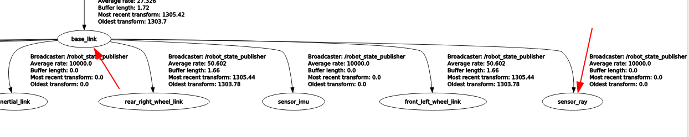

以及  `odom` 和 base_link 之间的变换（由 `robot_pose_ekf` 发布融合数据）：

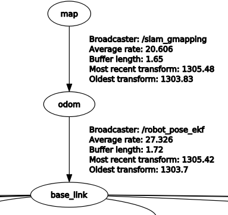

在正确配置 tf 树以及 topic 后即可让我们的车辆开始运动，gmapping 会实时更新地图数据。

### map_server

官方文档地址：http://wiki.ros.org/map_server

用于提供 `map_server` 和 `map_saver` 功能。其中 `map_saver` 是一个命令行工具，用于保存地图数据为 YAML 格式的文件：

```yaml
image: map1.pgm # 地图对应图片的路径名；可以是绝对路径，也可以相对于 YAML 文件位置的相对路径. 用不同的像素颜色描述世界中每个cell的占用状态。白色像素表示free，黑色像素表示occupied, 其它颜色像素表示unknown
resolution: 0.050000 # 分辨率 米/像素
origin: [-50.000000, -50.000000, 0.000000] # 地图左下像素的2-D姿势（x，y，yaw），yaw 为逆时针旋转角度（YAW = 0表示无旋转）。系统的许多部分目前忽略了 yaw
negate: 0 # 是否翻转黑白像素代表的含义
occupied_thresh: 0.65 # 占用概率大于此阈值的像素被认为是完全占用的
free_thresh: 0.196 # 用概率小于此阈值的像素被认为是自由的
```

当作为 `map_server` 使用时创建爱你一个 `map_server` 节点，利用从磁盘读取的地图数据提供 ROS 服务。`map_server` 的当前实现将MAP 图像数据中的颜色值转换为三元占用值：Free（0），占用（100）和未知（-1）。

一个简单的 launch 例子如下：

```xaml
<node pkg="map_server" type="map_server" name="map_server" args="$(find scout_gazebo_sim)/maps/$(arg map_name).yaml" output="screen">
    <param name="frame_id" value="map"/>
</node>
```

### amcl

`amcl` 是一个用于 2D 移动机器人的定位系统，其实现了自适应（或KLD采样）蒙特卡洛定位方法，该方法使用粒子群算法来跟踪机器人在已知地图上的位姿，仅使用已知地图和激光雷达信息即可运行。官方文档：http://wiki.ros.org/amcl

其配置信息位于  `src/scout_gazebo_sim/param/amcl_params_diff.yaml` 一般情况下保持默认即可。

### move_base

官方文档地址：http://wiki.ros.org/move_bas

`move_base` 就是我们导航系统的核心组件了，给定一个地图上的目标，它会尝试计算全局路径和局部路径用于导航。使用两个规划器（全局和局部）的意义在于，全局路径可以很理想，但是在移动过程中难免会存在遇到障碍物等问题，这时候就需要局部规划指导机器人移动。其接口信息如图所示（来源：http://wiki.ros.org/move_base）

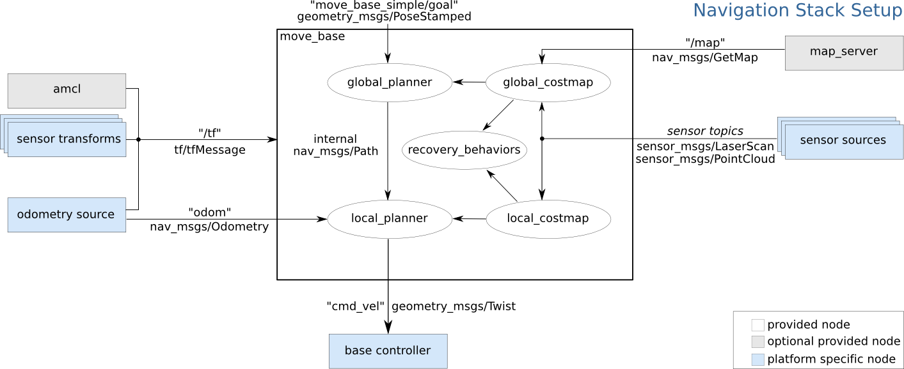

需要注意的是，`move_base` 是 ROS1 专用包，在 ROS2 中被 `Navigation2` 替代

其配置信息如下：

```xaml
<node pkg="move_base" type="move_base" respawn="false" name="move_base" output="screen">
    <rosparam file="$(find scout_gazebo_sim)/param/costmap_common_params.yaml" command="load" ns="global_costmap" />
    <rosparam file="$(find scout_gazebo_sim)/param/costmap_common_params.yaml" command="load" ns="local_costmap" />
    <rosparam file="$(find scout_gazebo_sim)/param/local_costmap_params.yaml" command="load" />
    <rosparam file="$(find scout_gazebo_sim)/param/global_costmap_params.yaml" command="load" />
    <rosparam file="$(find scout_gazebo_sim)/param/planner.yaml" command="load" />
    <param name="base_global_planner" value="global_planner/GlobalPlanner" />
    <param name="planner_frequency" value="1.0" />
    <param name="planner_patience" value="5.0" />
    <param name="base_local_planner" value="base_local_planner/TrajectoryPlannerROS" />
    <param name="controller_frequency" value="5.0" />
    <param name="controller_patience" value="15.0" />
    <param name="clearing_rotation_allowed" value="true" />
</node>
```

相关的参数内容较多，除 tf 广播信息 和 节点名称 外大部分参数保持默认信息即可，如有需要可对照官方文档进行修改

## 5.结语

对于 `scout_mini` 仿真导航的相关介绍到这里就结束了，作为初学者或者使用者，大部分时候我们并不关心软件包或者插件背后的算法实现。笔者同样建议在深入学习其背后原理之前先对其效果有直观感受，在会用的基础上进行深入，如此才能更快理解算法为什么要这样设计以及如何编写属于自己的程序。


---

> 作者: Anthony  
> https://anthonysun256.github.io/scout_mini_navi/
