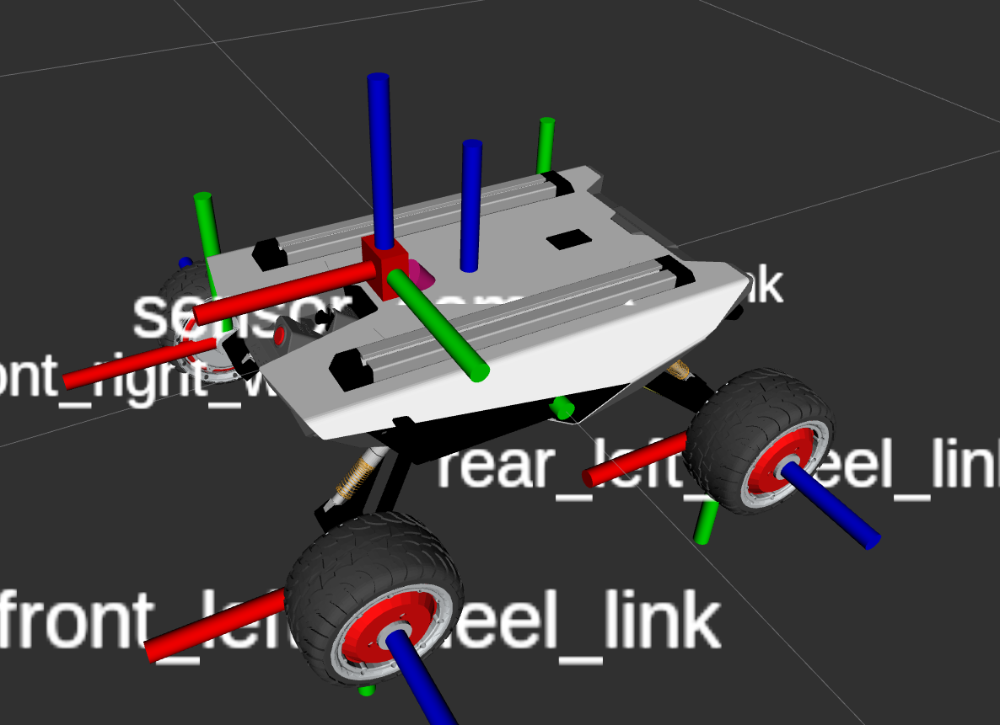
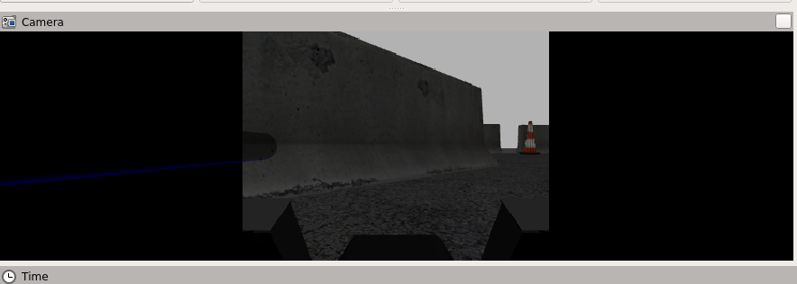

# Scout mini 仿真指南


> 本文适合有 ROS1 基础与了解 urdf语法 和 gazebo 的朋友

SCOUT MINI 是一款全地形高速Mini UGV，具有四轮差速驱动、独立悬挂、原地差速自转等特点，得益于自主研发的轻量级动力系统解决方案，SCOUT MINI最大速度高达10KM/H，专为前沿科学实验设计的全能型移动研究平台。

<!--more-->

此外，松灵为用户提供了 SCOUT MINI 的完整 gazebo 仿真支持库，本文将带您逐步上手使用：

> 仓库地址：https://github.com/agilexrobotics/ugv_gazebo_sim

## 1. 开发环境配置

目前官方提供的仿真环境是 `ROS-melodic` + `gazebo9` ，**如果您已配置好相关环境请跳过本节**。

编者这里使用的开发环境是 `docker` + `VSCode` ，这个组合的好处可以参考我的博客文章：[Docker 配合 VSC 开发最佳实践]()

我们首先新建工作空间文件夹，并使用 `catkin` 初始化工作空间：

```shell
$ mkdir scout_ws && cd scout_ws
$ mkdir src .devcontainer
$ cd ../.devcontainer
```

在 `.devcontainer` 中新建 `devcontainer.json` 和 `Dockerfile` 两个文件：

```shell
$ gedit devcontainer.json # 也可以自行更换其他的编辑器
```

在 `devcontainer.json` 保存如下内容：

```json
{
	"dockerFile": "Dockerfile",
	"build": {
		"args": {
			"WORKSPACE": "${containerWorkspaceFolder}"
		}
	},
	"remoteUser": "ros",
	"runArgs": [
		"--network=host",
		"--cap-add=SYS_PTRACE",
		"--security-opt=seccomp:unconfined",
		"--security-opt=apparmor:unconfined",
		"--volume=/tmp/.X11-unix:/tmp/.X11-unix"
	],
	"containerEnv": { "DISPLAY": "${localEnv:DISPLAY}" },
	// Set *default* container specific settings.json values on container create.
	"settings": {
		"terminal.integrated.profiles.linux": {
			"bash": {
				"path": "bash"
			},
		},
		"terminal.integrated.defaultProfile.linux": "bash"
	},
	"extensions": [
		"dotjoshjohnson.xml",
		"zachflower.uncrustify",
		"ms-azuretools.vscode-docker",
		"ms-iot.vscode-ros",
		"ms-python.python",
		"ms-vscode.cpptools",
		"redhat.vscode-yaml",
		"smilerobotics.urdf",
		"streetsidesoftware.code-spell-checker",
		"twxs.cmake",
		"yzhang.markdown-all-in-one"
	]
}
```

> 其中各个字段的具体含义可以参考我的博文 [Docker 配合 VSC 开发最佳实践]()

```shell
$ gedit Dockerfile
```

在 `Dockerfile` 中保存以下内容：

````dockerfile
FROM althack/ros:melodic-gazebo

# Set up auto-source of workspace for ros user
ARG WORKSPACE
RUN echo "if [ -f ${WORKSPACE}/install/setup.bash ]; then source ${WORKSPACE}/install/setup.bash; fi" >> /home/ros/.bashrc
````

> 其中各个字段的具体含义可以参考我的博文 [Docker 配合 VSC 开发最佳实践]()

此时，目录结构如下：

```
scout_ws
├── .devcontainer
│   ├── devcontainer.json
│   └── Dockerfile
└── src

```

使用 VSC 在 docker 中打开文件夹：

```shell
$ cd scout_ws
$ code .
```

> 后续具体操作请见：[Docker 配合 VSC 开发最佳实践]()

最后，需要更新 `apt` 和 `rosdep database`

```shell
$ sudo apt update
$ rosdep update
```

## 2. 仿真环境配置

将`https://github.com/agilexrobotics/ugv_gazebo_sim/tree/master/scout` 中的 `scout_control` 、`scout_description` 、`scout_gazebo_sim` 三个文件放到 `src`目录之中。

安装如下 ROS 库：

```shell
$ sudo apt-get -y install --no-install-recommends \
ros-melodic-ros-control \
ros-melodic-ros-controllers \
ros-melodic-gazebo-ros \
ros-melodic-gazebo-ros-control \
ros-melodic-joint-state-publisher-gui \
ros-melodic-teleop-twist-keyboard
```

然后初始化工作空间并安装依赖：

```shell
$ cd scout_ws/src
$ catkin_init_workspace
$ cd ..
$ rosdep install --from-paths src --ignore-src -r -y
```

即可正常编译与运行：

```shell
$ catkin_make
$ source devel/setup.bash
```

`scout_description` 包主要为 `scout` 系列车型仿真模型，`display_xxx_.launch` 为不同车型在 Rviz 中的展示：

```shell
$ roslaunch scout_description display_mini_models.launch # 在 Rviz 中查看 scout mini 车型
```

 `scout_gazebo_sim` 包为 `scout` 系列车型在 `gazebo` 中的仿真，`scout_xxx_.launch` 为不同车型在 gazebo 中仿真展示

```shell
$ roslaunch scout_gazebo_sim scout_mini_empty_world.launch # 在 gazebo 中使用空地图仿真 scout mini
```


使用 playpen 地图前需要补全 gazebo 的 models，不然会一直黑屏


## 3. 添加自定义传感

官方的仿真模型中并未添加现成传感器，这也很好理解——车辆上本来就没有，无故添加反而会在实际使用中让人疑惑。

scout 系列车型的 urdf 描述文件位于 `scout_description/urdf` 中，在这里我们并未直接使用 urdf 文件进行描述，而是从 xacro （xml macro) 描述文件中生成 urdf 信息。使用 xacro 的好处在于我们可以像编程一样实现复用一些 urdf 节点以及将不同的组件拆分等功能。

> 如果您不了解 xacro，可以先阅读 xacro 语法说明：http://wiki.ros.org/xacr
>
> 其相当于扩展了 urdf 的语法，可以以更便捷的方式描述我们的机器人。

下面我将带大家使用 xacro 为小车加上一个简易摄像头：

首先在我们的 `scout_description/urdf` 中添加一个名为 `universal_sensor_adder.xacro` 的文件，其中保存如下内容：

```xml
<?xml version="1.0"?>
<!-- 
Author: AnthonySuen
Date: 2020-4-8
-->
<robot xmlns:xacro="http://www.ros.org/wiki/xacro" name="universal_sensor_adder">
    <!-- 用于生成一个新的传感器节点, 
    x_offset y_offset z_offset r p y对应于传感器和 base_link 的相对位置
    sensor_config 为传感器的配置信息
    sensor_plugin_config 为 gazebo 相关插件的配置内容 -->
    <xacro:macro name="add_sensor" params="sensor_name type x_offset y_offset z_offset r p y **sensor_config **sensor_plugin_config">
        <link name="sensor_${sensor_name}">
            <!-- 配置传感器视觉信息 -->
            <visual>
                <geometry>
                    <box size="0.03 0.05 0.05"/>
                </geometry>
                <material name="red">
                    <color rgba="1.0 0.0 0.0 1.0"/>
                </material>
            </visual>
            <!-- 配置碰撞体积, 为gazebo仿真使用 -->
            <collision>
                <origin xyz="0.0 0.0 0.0" rpy="0.0 0.0 0.0"/>
                <geometry>
                    <box size="0.03 0.05 0.05"/>
                </geometry>
            </collision>
            <!-- 配置惯性矩阵, 用于 gazebo 仿真,这里我假设传感器很轻很小 -->
            <inertial>
                <origin xyz="0.0 0.0 0.0" rpy="0.0 0.0 0.0"/>
                <mass value="1e-5"/>
                <inertia ixx="1e-6" ixy="1e-6" ixz="1e-6" iyy="1e-6" iyz="1e-6" izz="1e-6"/>
            </inertial>
        </link>
        <!-- 配置关节信息, 这里我默认传感器是固定在车上的 -->
        <joint name="sensor_${sensor_name}_joint" type="fixed">
            <parent link="base_link"/>
            <child link="sensor_${sensor_name}"/>
            <origin xyz="${x_offset} ${y_offset} ${z_offset}" rpy="${r} ${p} ${y}"/>
        </joint>
        <!-- gazebo 配置仿真配置部分 -->
        <gazebo reference="sensor_${sensor_name}">            <!-- 此部分要与 传感器 link 名称保持一致 -->
            <sensor name="${sensor_name}" type="${type}">
                <!-- 这里会插入传感器自身配置信息和相关插件的配置内容 -->
                <xacro:insert_block name="sensor_config"/>
                <xacro:insert_block name="sensor_plugin_config"/>
            </sensor>
        </gazebo>
    </xacro:macro>
</robot>
```


请在使用时删除中文注释，xacro 无法解析非 ascii 字符！


编辑 `empty.urdf` 文件，修改其中内容如下：

```xaml
<?xml version="1.0"?>
<!-- 
Author: AnthonySuen
Date: 2020-4-8
-->
<robot xmlns:xacro="http://www.ros.org/wiki/xacro" name="sensors">

  <!-- 加载我们之前编写的文件，之后可以使用其中相关内容 -->
  <xacro:include filename="$(find scout_description)/urdf/universal_sensor_adder.xacro" />
  <!-- 使用我们编写的函数，填入相关参数 -->
  <xacro:add_sensor sensor_name="camera" type="camera" x_offset="0.1" y_offset="0.0" z_offset="0.085" r="0.0" p="0.0" y="0.0">
  <!-- 这部分会替换 <xacro:insert_block name="sensor_config"/> 中的内容 -->
    <sensor_config>
      <update_rate>30</update_rate>
      <camera name="general_camera">
        <image width="640" height="480" hfov="1.5708" format="RGB8" near="0.01" far="50.0"/>
      </camera>
    </sensor_config>
    <!-- 这部分会替换 <xacro:insert_block name="sensor_plugin_config"/> 中的内容 -->
    <sensor_plugin_config>
      <plugin name="general_camera_controller" filename="libgazebo_ros_camera.so">
        <alwaysOn>true</alwaysOn>
        <updateRate>36.0</updateRate>
        <cameraName>sensor_camera</cameraName>
        <imageTopicName>image_raw</imageTopicName>
        <cameraInfoTopicName>camera_info</cameraInfoTopicName>
        <frameName>sensor_camera</frameName> <!-- 需要与 传感器 link 名称保持一致 -->
        <hackBaseline>0.1</hackBaseline>
        <distortionK1>0.0</distortionK1>
        <distortionK2>0.0</distortionK2>
        <distortionK3>0.0</distortionK3>
        <distortionT1>0.0</distortionT1>
        <distortionT2>0.0</distortionT2>
      </plugin>
    </sensor_plugin_config>
  </xacro:add_sensor>
</robot>
```

> empty.urdf 会在我们模型生成的时候被 mini.xacro 等车辆描述文件加载，所以我们不用去更改其他模型文件，这样保持了开发的整洁性


请在使用时删除中文注释，xacro 无法解析非 ascii 字符


之后运行一下 Rivz 查看我们修改后的模型：

```shell
$ roslaunch scout_description display_mini_models.launch
```

可以看到车辆头顶出了一个红色小方块，这就是我们的简易摄像头模型



也可以在 gazebo 中仿真并用 Rviz 接收图像：

```shell
$ roslaunch scout_gazebo_sim  scout_mini_playpen.launch
```




至此，便完成了添加传感器并进行仿真的全部流程，对于其他类型传感器，诸如 深度相机 激光雷达 imu 等，其添加方法一样方便，唯一不同点在我们编写的函数中 `sensor_config` 与 `sensor_plugin_config` 块中对于不同传感器的配置，简单修改即可适配不同传感器。

