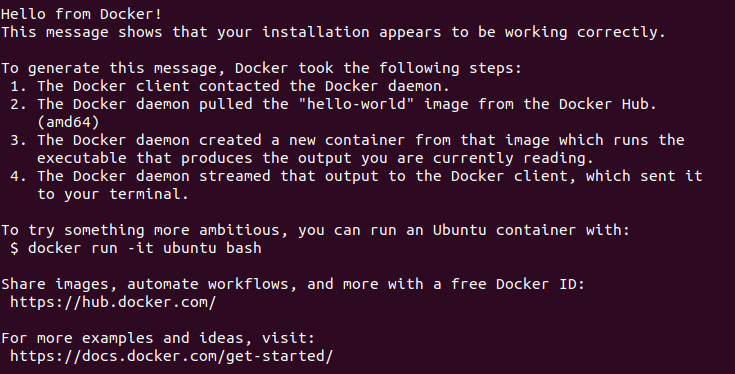
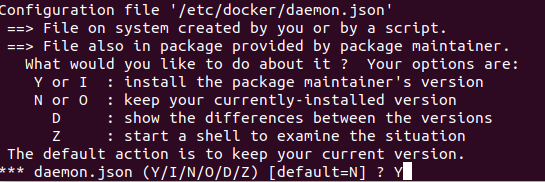

# 在 limo 中安装 docker


## 1. 安装 Docker 引擎

首先清除旧版本 Docker：

```shell
$ sudo apt-get remove docker docker-engine docker.io containerd runc
```

之后使用官方安装脚本进行安装：

```shell
$ curl -fsSL https://get.docker.com -o get-docker.sh
$ sudo sh get-docker.sh
```

将当前用户添加到 docker 用户组，使非 root 用户也能使用 Docker（**使用 root 登陆用户跳过此步骤**）:

```shell
sudo systemctl restart dockersudo systemctl restart docker$ sudo usermod -aG docker ${USER}
$ sudo systemctl restart docker
```

更换 docker 源为国内源：

```shell
$ sudo mkdir -p /etc/docker
$ sudo tee /etc/docker/daemon.json <<-'EOF'
{
  "registry-mirrors": ["https://ustc-edu-cn.mirror.aliyuncs.com/"]
}
EOF
$ sudo systemctl daemon-reload
$ sudo systemctl restart docker
```

后续如果需要更改镜像地址，自行编辑 ``/etc/docker/daemon.json`` 即可。

重新登陆系统，测试 docker：

```shell
$ docker run --rm hello-world
```

1得到以下输出证明安装成功：

sudo systemctl restart docker

## 2. 安装 docker-compose 插件

下载官方插件文件（这里使用了 Github 加速服务）：

```shell
$ sudo curl -L "https://ghproxy.com/https://github.com/docker/compose/releases/download/v2.4.1/docker-compose-linux-aarch64" -o /usr/local/bin/docker-compose
```

> 如果无法下载，使用以下指令：
>
> ```shell
> $ sudo curl -L "https://github.com/docker/compose/releases/download/v2.4.1/docker-compose-linux-aarch64" -o /usr/local/bin/docker-compose
> ```

授予插件执行权限：

```shell
$ sudo chmod +x /usr/local/bin/docker-compose
```

完成后执行：

```shell
 $ docker-compose --version
```

输出版本信息即为成功：

```
Docker Compose version v2.4.1
```

## 3. 安装需要添加 Nvidia 支持

首先添加 仓库 和 GPG key：

```shell
$ distribution=$(. /etc/os-release;echo $ID$VERSION_ID) \
      && curl -fsSL https://nvidia.github.io/libnvidia-container/gpgkey | sudo gpg --dearmor -o /usr/share/keyrings/nvidia-container-toolkit-keyring.gpg \
      && curl -s -L https://nvidia.github.io/libnvidia-container/$distribution/libnvidia-container.list | \
            sed 's#deb https://#deb [signed-by=/usr/share/keyrings/nvidia-container-toolkit-keyring.gpg] https://#g' | \
            sudo tee /etc/apt/sources.list.d/nvidia-container-toolkit.list
```

然后更新源：

```shell
$ sudo apt-get update
```

安装 nvidia-docker：

```shell
$ sudo apt-get install -y nvidia-docker2
```

在提示界面选择 `Y`



> 这里会覆盖之前填写的 docker 镜像地址等配置，需要重新编辑  ``/etc/docker/daemon.json`` 

然后重启 docker 服务：

```shell
$ sudo systemctl restart docker
```

最后运行：

```shell
$ docker run --rm -it --gpus all nvcr.io/nvidia/l4t-base:r34.1
```

成功启动即代表配置成功

